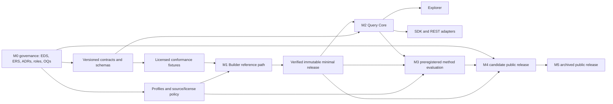

# EXPEDIA implementation roadmap: M0 through M5

**Status:** Current through the accepted M2 internal completion gate; M3 is
planning-only until its evaluation-governance gate is accepted.
**Design authority:** `EXPEDIA_Design_Specification_EDS_v2.1.1.docx` (EDS v2.1.1)
**Requirements authority:** `EXPEDIA_Requirements_Specification_ERS_v1.0.docx` (ERS v1.0)

## 1. Decision context and repository review

EDS v2.1 specifies an atlas-first scientific platform. An Atlas Release, not a
desktop application, is the citable scientific object. The Builder creates
releases, Query Core is the single owner of read-only query semantics, and
Explorer, SDK, and REST are clients of Query Core.

The repository previously contained only the EDS/ERS source documents, project
context, and empty render-QA directories. It had no implementation, contract,
schema, fixture, test, ADR, or subsystem structure. It also contains a `.git`
directory that is not recognized as a valid Git repository. This is appropriate
for a pre-M0 repository, but it means no implementation or source-control claim
can yet be made.

The directory skeleton created with this roadmap follows EDS section 16 and its
repository-layout table. It deliberately contains no executable implementation.

### Governing-specification qualification

EDS v2.1's document-control status is **Canonical draft**: it becomes the
project source of truth only after the governance owner accepts or revises the
proposed ADRs and release policy. This roadmap therefore treats EDS v2.1 as the
operating design authority, while making formal acceptance a P0 M0 exit gate.

### EDS editorial corrections to log before acceptance

These are editorial consistency corrections, not architectural changes:

1. OQ-10 (signature/trust-root policy) and OQ-11 (v1 filter grammar and cost
   limits) appear in the local trust-model table but are absent from Appendix C.
   Add them to the open-question register with owners and disposition.
2. The benchmark subsections in chapter 13 are labelled `12.1` and `12.2`.
3. The publication checklist in chapter 15 is labelled `14.1`, and the CI-gate
   subsection in chapter 16 is labelled `15.1`.

No implementation should compensate for these numbering defects. Correct them
in an EDS v2.1.1 editorial revision, or record the exact anchors in an ADR
until that revision is accepted.

## 2. Dependency model

| Dependency | Required before | Why it is a hard dependency |
|---|---|---|
| Accepted ADRs, release roles, source/license policy | All implementation | Prevents code from redefining scientific or publication semantics. |
| Contract versioning and schema compatibility policy | Fixtures, Builder, reader, Query Core | All artifacts and adapters must have stable, testable meaning. |
| Canonicalization and record-identity policy | Registrar, embeddings, provenance | A changed sequence cannot reuse an immutable record identity. |
| Baseline profile declaration | M1 embedding path | Vectors are meaningful only in a fully declared profile. |
| Licensed minimal fixture corpus | Builder/reader/query tests | Enables deterministic, independent verification without biological-performance claims. |
| Verified immutable release | Query Core, Explorer, SDK, REST | Clients must query a trusted release rather than a mutable workspace. |
| Query Core result contract | Explorer, SDK, REST | Prevents client-specific filter, ranking, provenance, or pagination semantics. |
| Preregistered evaluation and raw evidence | Public method claims and default-method promotion | Retrieval quality is not established by a prototype or visualization. |
| Archive, retention, correction, signature policy | M4/M5 | Publication creates a long-lived scientific-record obligation. |

## 3. M0: governance and contract foundation

**Goal:** make the specification govern future implementation unambiguously.

### P0 work packages

1. Establish specification control.
   - Assign a governance owner and a change-control process.
   - Accept, revise, or explicitly defer ADR-001 through ADR-016. At minimum,
     resolve ADR-002/003/004/005/006/007/008/012/013/015/016 before M1 code;
     ADR-009 and ADR-014 before any public method claim; ADR-010/011 before
     M2 adapters/ANN choices.
   - Correct the editorial defects listed above and retain EDS v2.1 as an
     immutable historical input.

2. Assign and disposition implementation-blocking open questions.
   - Establish owner, required evidence, target decision date, and a status for
     every OQ. Do not replace unresolved decisions with defaults hidden in code.

3. Define the contract governance system.
   - Choose normative serializations: JSON Schema for manifests and API value
     objects; Arrow/Parquet schema definitions for release tables; OpenAPI only
     for the REST transport adapter.
   - Define contract identifiers, semantic-version policy, compatibility rules,
     migration policy, canonical serialization/digest rules, and deprecation
     policy.
   - Put normative source schemas in `schemas/`; generated bindings are not a
     source of truth.

4. Establish reproducibility and evidence controls.
   - Define build-environment lock/SBOM policy, digest algorithm and artifact
     descriptor, stage-manifest retention, waiver record, source/evidence ledger,
     and fixture licensing rules.
   - Define the clean-room verification protocol and CI evidence retention
     convention before a release builder exists.

5. Create governed minimal fixtures.
   - Specify, but do not yet populate beyond licensed synthetic/minimal data,
     positive and negative fixtures for duplicate identity, corrupted digest,
     unsupported profile comparison, invalid plugin descriptor, failed gate,
     missing annotation semantics, and invalid cursor binding.

6. Initialize source control deliberately.
   - Confirm whether the existing nonfunctional `.git` directory is disposable
     setup residue or contains recovery-relevant metadata, then initialize or
     repair the repository under an agreed branch, ignore-file, authorship, and
     protection policy. Do not manufacture historical commits.

### M0 acceptance criteria

- EDS v2.1 (or its explicitly identified editorial successor) has an accepted
  document-control status; every accepted, revised, or deferred ADR has an
  owner and rationale.
- ERS REQ-001 through REQ-025 map to an EDS anchor, ADR disposition, planned
  component, contract, test fixture, and documentation location.
- The contract catalogue below exists with versioning/compatibility rules and
  review ownership; schema drafts pass structural validation.
- OQ-01, OQ-02, OQ-03, and OQ-06 have the accepted M1 dispositions recorded
  below. Their implementation evidence belongs in the first BuildManifest,
  profile declaration, and release-governance record. See
  [`M1-PROVISIONAL-RESOLUTIONS.md`](../../specification/open-questions/M1-PROVISIONAL-RESOLUTIONS.md).
- Repository paths prescribed by EDS section 16 exist; no production runtime,
  model, client, or storage implementation has been introduced.
- Version control is a valid repository with an agreed default-branch and
  baseline protection policy; the pre-existing invalid `.git` state has an
  auditable disposition.
- A CI design document defines schema, fixture, provenance, and documentation
  checks, even if automation is introduced only with the first schemas.

## 4. Minimum contracts and schemas before production code

These are the minimum *normative definitions* required before production code.
They can begin as reviewed schema drafts and contract prose; generated types and
implementations follow only after their semantics are accepted.

| Priority | Contract/schema | Minimum semantic content | Primary consumers |
|---|---|---|---|
| P0 | Contract meta-schema and compatibility policy | `contract_id`, version, status, canonical serialization, digest, compatibility, migration and deprecation rules | Every subsystem |
| P0 | ReleaseManifest and ArtifactDescriptor | release identity/state/scope/citation/licenses; artifact path/type/digest/size/schema; validation bundle and approvals | Builder, reader, catalog |
| P0 | GenomeRecordVersion and AtlasEntity | immutable record ID, entity handle, sequence digest, canonicalization, source provenance, lifecycle | Registrar, graph, profiles |
| P0 | SourceProvenance, license, and evidence records | source/version/acquisition, license/access restrictions, evidence type/status, references and qualifiers | Builder, release review, Explorer |
| P0 | EmbeddingProfile and EmbeddingInstance | model/input/preprocessing/pooling/output/metric/compatibility/provenance/validation/lifecycle; profile-scoped shard-row reference | Registry, Builder, Query Core |
| P0 | AnnotationAssertion | target, predicate/value, source/version, evidence, source-defined confidence semantics, supersession | Annotation worker, Query Core, Explorer |
| P0 | DerivedRelation and DerivedArtifact lineage | typed endpoints, derivation/profile/release scope, parameters, score semantics, inputs, artifact digest | Derivation, Query Core |
| P0 | BuildManifest, StageInput/StageOutput, StageOutcome | pinned sources/plugins/configuration, input/output digests, exclusions, failures, recovery and verification state | Atlas Builder |
| P0 | PluginDescriptor and capability negotiation | interface version, capabilities, media types, determinism/tolerance, configuration schema, license, identity digest/signature, compatibility range | Plugin host, Builder, Query Core |
| P0 | Release lifecycle, approval, waiver, and withdrawal records | allowed state transition, actor/role, guard, review/waiver rationale, expiry, successor/tombstone linkage | Release engineering |
| P1 (before M2 code) | QueryRequest, FilterExpression, TraversalSelector | explicit release/profile/metric, filter grammar distinguishing missing/unavailable/false, relation selector, exact/approximate request | Query Core, SDK, REST |
| P1 (before M2 code) | QueryResult, provenance, warning, and Cursor | release/schema/profile/metric/mode/artifact lineage/result rows; cursor bound to release/request/order/last key | Query Core, Explorer, SDK, REST |
| P1 (before M3 studies) | ValidationBundle and BenchmarkPreregistration | question, cohort/split, methods/baselines, metrics, uncertainty, failure analysis, claim limits, result references | Validation, release review |

## 5. Phased roadmap

| Milestone | Priority and scope | Dependencies | Deliverables | Acceptance criteria |
|---|---|---|---|---|
| M0 — Governance and contracts | P0. Freeze semantics before code. | None; resolves governance blockers. | Accepted EDS/ERS control, ADR register, OQ register, schema catalogue, repository skeleton, CI/fixture/reproducibility policies. | M0 criteria in section 3 pass; no implementation claims. |
| M1 — Minimal reproducible release | P0. Prove the local reference release path with a small licensed scope. | M0 and the accepted OQ-01/OQ-02/OQ-03/OQ-06 M1 decisions. | Pinned BuildManifest; registered canonical records; one declared baseline profile; minimal vectors; release manifest; validation bundle; local release reader; clean-room fixture. | A second environment independently builds or reconstructs the fixture, opens it offline, verifies all digests/schemas, and observes recorded exclusions. No biological-performance claim. |
| M2 — Query Core and Explorer | **Complete (internal).** Established one semantic read path. | M1 verified release; query contracts; ADR-010/011/016 accepted. | Local Query Core; exact fixture search; typed SDK wrapper; REST adapter/OpenAPI; provenance-first Explorer. | The same conformance requests through Core, SDK, and REST return equivalent logical results, provenance, filtering, ordering, errors, and cursor behavior. Explorer distinguishes canonical, asserted, and derived information. |
| M3 — Method evaluation | P1. Produce evidence, not feature demonstrations. | M1/M2; OQ-04/05/08 as applicable; ADR-009/014 accepted. | Preregistered studies, versioned cohorts/baselines, exact ground truth where applicable, raw result artifacts, uncertainty/failure analysis, decision ADRs. | Each claim is scoped to its preregistered evidence. No default profile/index/bridge/graph method is promoted without required baselines and review. |
| M4 — Candidate public release | P0 for publication. Prepare a reviewable frozen package. | M1, appropriate M3 evidence, OQ-01/06/09/10/11 resolved, archival policy. | Candidate release package, evidence/validation bundle, citation and license metadata, release checklist, archive rehearsal, independent review. | All mandatory gates pass, the candidate bytes are frozen, a clean-room reader verifies it, licenses and claims are approved, and archive rehearsal produces a verified receipt. |
| M5 — Public archival release | P0 for publication. Publish the immutable scientific record. | M4 accepted candidate and actual archive capability. | Archived immutable release, persistent identifier, catalog entry, mirror/retention record, correction/withdrawal/support policy. | Deposit is complete; a second environment verifies the deposited bytes against the manifest; the release is citable and the successor/withdrawal process is published. |

## 6. Open questions and implementation gates

| Question | Status after M1 decision record | Required disposition before |
|---|---|---|
| OQ-01: M1 population, quality thresholds, licenses | Resolved for M1: NCBI RefSeq, committed 12-assembly inventory, complete-genome technical filter, internal validation only | M1 source acquisition and release scope |
| OQ-02: canonicalization, deduplication, merge/split policy | Resolved for M1: `m1-assembly-canonical-v1`; no automatic merge/split | Registrar, record identity, embeddings |
| OQ-03: M1 baseline profile and record unit | Resolved for M1: `m1-generanno-prokaryote-0.5b-assembly-v1`; one canonicalized assembly per record | Any embedding generation |
| OQ-04: ANN recall/resource configuration | Deferred; M2 retains exact cosine as the sole reference search path | Later ANN/default-index selection |
| OQ-05: benchmarks for allowable usefulness claims | Unresolved | M3 claims or default-method promotion |
| OQ-06: release/correction/waiver/withdrawal authority | Resolved for M1: single maintainer; expires on M4 entry | Candidate transition and any archival action |
| OQ-07: deployment/access-control model | Unresolved | Remote service or restricted-data work; not local M1/M2 |
| OQ-08: BridgeProfile evaluation/governance | Unresolved | Any cross-profile comparison |
| OQ-09: archive/mirror/retention policy | Unresolved | M4/M5 |
| OQ-10: release/plugin signature and trust roots | Unresolved | Trusted public distribution and plugin policy |
| OQ-11: v1 filter grammar and query cost limits | Resolved for M2: accepted deterministic v1 grammar, canonical request interpretation, and local-fixture limits | Any later query-scope expansion |

## 7. Principal risks and controls

| Risk | Consequence | Control and trigger |
|---|---|---|
| Treating a canonical draft as already accepted | Implementation outruns governance and later conflicts with EDS. | M0 document-control gate; no M1 code until ADR/OQ dispositions are recorded. |
| Unresolved sequence identity/canonicalization | Incorrect deduplication, provenance, and vector linkage. | OQ-02 decision plus adversarial identity fixtures before registrar work. |
| Model or ANN convenience becomes a scientific claim | Unsupported biological or retrieval claims. | Profile declarations, benchmark preregistration, evidence-status labels, exact-reference checks. |
| Source or release license uncertainty | Cannot lawfully reproduce or publish an atlas. | License/evidence ledger and OQ-01 decision before acquisition; release gate before Candidate. |
| Schema drift or generated-client drift | Builder, reader, and clients interpret releases differently. | Normative schema source, compatibility gates, versioned fixtures, SDK/REST/Core conformance. |
| Untrusted release/plugin | Integrity or supply-chain compromise. | Digest verification, safe extraction, pinned descriptors, least privilege, OQ-10 policy. |
| Archival policy deferred until publication | Broken citations or inability to correct/withdraw. | OQ-09/06 and archive rehearsal as M4 gates. |
| Invalid or ambiguous source-control state | Untraceable specifications, contracts, and evidence. | Treat Git initialization/repair as M0 governance work; preserve rather than assume away existing metadata. |

## 8. Recommended immediate sequence

1. Convene governance review for ADR and OQ assignment, including the editorial
   EDS corrections.
2. Approve the contract catalogue, serialization/compatibility policy, and
   fixture/license policy.
3. Author reviewed schema drafts and negative/positive fixture specifications.
4. Decide OQ-01, OQ-02, and OQ-03 with their evidence records.
5. Begin M1 only after those gates are satisfied; keep the first release small,
   offline-readable, and scientifically modest.

## 9. Explicit non-goals before M1

- Desktop application features, visual exploration polish, hosted services, or
  operational graph databases.
- Cross-profile comparison, BridgeProfiles, clustering/UMAP claims, graph
  refinement, or default ANN selection without evaluation evidence.
- Public identifiers, archival deposit, or performance/biological claims.
- Production code that establishes alternative release/query semantics.
