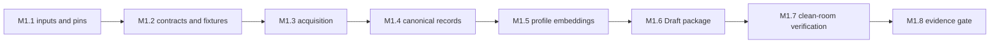

# M1 implementation plan: minimal reproducible atlas release

**Status:** M1 completed as an internal Draft reproducibility milestone; this
plan did not authorize Candidate, Published, archival, or public-release work.
**Governing specification:** EDS v2.1, especially sections 5.1, 6–9, 14–16,
and Appendix A  
**Requirements baseline:** ERS REQ-001–005, REQ-008–010, REQ-015,
REQ-018–022, and REQ-025  
**M1 decisions:** `specification/open-questions/M1-PROVISIONAL-RESOLUTIONS.md`

## 1. M1 outcome

M1 proves that EXPEDIA can construct, package, independently open, and verify a
small immutable-format atlas release. The deliverable is a controlled **Draft**
release package and its evidence bundle, not a public atlas, performance claim,
desktop application, or complete Query Core.

The M1 release contains 12 versioned NCBI RefSeq prokaryotic assemblies, their
canonical record representations and provenance, one fully declared GENERanno
profile, profile-scoped vectors, a manifest, validation evidence, and a local
reference reader. A second clean environment must reconstruct or independently
verify the package.

### Scope boundaries

Included:

- Builder reference path: acquire, register/canonicalize, validate, embed,
  package, and validate the Draft release.
- One profile: `m1-generanno-prokaryote-0.5b-assembly-v1`.
- Exact cosine retrieval only as a fixture-level vector verification path.
- A local reader that validates package integrity and exposes typed release data
  needed by tests.

Excluded:

- Candidate-to-Published transition, persistent identifiers, public
  distribution, broad license matrix, or archive deposition.
- ANN selection/tuning, cross-profile comparison, BridgeProfiles, graph
  derivation, annotations beyond source-provenance records, biological method
  claims, Explorer, SDK, REST, and full Query Core.

M1's exact-vector verification is deliberately not a Query Core API. Query
Core owns reusable query semantics and remains M2 work under ADR-016.

## 2. Preconditions and implementation inputs

These are execution inputs, not new architectural decisions. They must be
materialized before their dependent work begins.

| Input | Owner role | Required form | Gate |
|---|---|---|---|
| M1 assembly inventory | Project maintainer | Committed list of 12 versioned `GCF_` accessions, with domain classification and source notice | Before acquisition |
| Build input provenance | Builder owner | Pinned NCBI Datasets CLI version, source package checksum, retrieval timestamp, and command/configuration digest | Before registration |
| Profile artifact pin | Method owner | Immutable GENERanno model revision, content digest, tokenizer/configuration digest, license text, and plugin descriptor | Before embedding |
| Reproducible runner | Builder owner | Environment lock/SBOM, accelerator declaration, numeric-library versions, seed/determinism statement, and tolerance if required | Before embedding |
| Schema review | Contract owner | Approved M1 contract versions and compatibility rules | Before any persistent artifact |
| Release authority | Project maintainer | M1 Release Owner/Approver identity and approval-record format | Before Draft-release approval |

## 3. Work breakdown

Complexity is relative engineering complexity: **S** (small), **M** (moderate),
**L** (large), and **XL** (high integration or reproducibility risk). It is not
a duration or performance estimate.

| ID | Milestone and tasks | Dependencies | Deliverables | Acceptance criteria | Complexity |
|---|---|---|---|---|---|
| M1.1 | **Freeze M1 inputs.** Commit the 12-accession inventory; record NCBI source notice and intended internal-use restriction; pin NCBI Datasets, model artifact, tokenizer, plugin descriptor, and runner environment; create the BuildManifest skeleton. | M0 contract governance; M1 OQ record | Inventory, source-provenance evidence, BuildManifest, profile declaration, plugin descriptor, environment lock/SBOM | Every external input is identified by immutable version/digest where available; no credentials enter the manifest; model license and custom-code identity are captured. | M |
| M1.2 | **Finalize the M1 contract pack and fixtures.** Review JSON/Arrow/Parquet schemas for ReleaseManifest, ArtifactDescriptor, GenomeRecordVersion, AtlasEntity, source provenance, EmbeddingProfile, EmbeddingInstance, BuildManifest, stage envelope, validation bundle, and approval/waiver records. Define canonical serialization and test fixtures. | M1.1 for actual profile values; M0 compatibility policy | Versioned schema set, schema catalogue, positive fixture, malformed-manifest fixture, corrupted-digest fixture, invalid profile fixture, identity-edge-case fixture | Schema validation succeeds for the positive fixture and rejects every negative fixture with a typed, testable failure. Contracts contain no runtime-specific undocumented fields. | L |
| M1.3 | **Acquire and account for source inputs.** Retrieve only the committed NCBI package; verify package checksums/catalogue; register every declared input before filtering; capture source metadata and license notice. | M1.1, M1.2 stage envelope | Acquired source artifact, acquisition StageOutcome, source inventory account, quarantine/exclusion records if needed | The number of registered source assemblies equals the committed inventory; every missing or rejected item has an explicit recorded reason; no silent omission occurs. | M |
| M1.4 | **Register and canonicalize records.** Apply `m1-assembly-canonical-v1`; create AtlasEntity and GenomeRecordVersion records; calculate sequence digests; validate referential integrity and canonicalization edge cases. | M1.2, M1.3 | Canonical records table, entity table, provenance table, canonicalization StageOutcome | Repeated execution over identical input produces byte-identical canonical representations and digests; changed accession version creates a new record version; forbidden symbols/missing accessions quarantine rather than mutate or disappear. | L |
| M1.5 | **Execute one profile-specific embedding stage.** Resolve only the pinned GENERanno descriptor; run contig windows, declared pooling, float32 output conversion, normalization, and profile-scoped vector-shard writing. Record all runner and tolerance evidence. | M1.1 profile/runner pins, M1.2 profile/stage contracts, M1.4 eligible records | EmbeddingProfile record, EmbeddingInstance table, vector shard(s), shard manifest, embedding StageOutcome | Every eligible record maps to exactly one instance under the one profile; vector dimensions/dtype/normalization agree with the profile; shard row mapping and digests verify; no implicit CPU, precision, model, or tokenizer fallback occurs. | XL |
| M1.6 | **Package the Draft release.** Assemble canonical tables, profile-scoped vectors, manifests, schema references, provenance, licenses/notices, validation evidence, and release metadata. Compute artifact digests and freeze a Draft release directory. | M1.2, M1.4, M1.5 | ReleaseManifest, artifact inventory, Draft package, package StageOutcome | Manifest covers every packaged artifact with type, path, size, digest, and contract version; package contains no credentials; a missing/changed artifact causes integrity rejection. | L |
| M1.7 | **Validate locally and in a clean environment.** Implement/run schema, digest, referential-integrity, release-reader, reconstruction, and failure-path checks. The independent environment uses only committed manifests, pinned inputs, and documented prerequisites. | M1.6 | ValidationBundle, clean-room run record, reader fixture, failures/waivers if any, M1 approval record | A second environment opens the package offline after inputs are present, verifies all manifest and artifact digests, reads all required tables/vectors, and either reconstructs the same package or records an approved, predeclared tolerance-only difference. Any mandatory-gate failure prevents M1 completion. | XL |
| M1.8 | **Close the M1 evidence gate.** Review ERS traceability, source/provenance notices, stage outcomes, validation bundle, and claimed status. Retain the package as Draft and record the maintainer’s decision. | M1.7; M1 Release Owner/Approver | Updated ERS traceability entries, M1 evidence index, approval or rejection record | Every M1 requirement has an implementation location, fixture/test evidence, and documentation link; release is labelled Draft; no biological, scalability, or performance claim is published. | M |

## 4. Contract-to-work mapping

| Contract | First authoring milestone | First enforcing milestone | Why it comes first |
|---|---|---|---|
| BuildManifest, StageInput/Output/Outcome | M1.1–M1.2 | M1.3 | Prevents stage-specific hidden state and enables recovery evidence. |
| GenomeRecordVersion, AtlasEntity, source provenance | M1.2 | M1.4 | Record identity must precede vector generation. |
| EmbeddingProfile, PluginDescriptor, EmbeddingInstance, vector shard manifest | M1.1–M1.2 | M1.5 | Embeddings are meaningless without declared profile and runner semantics. |
| ReleaseManifest and ArtifactDescriptor | M1.2 | M1.6 | Packaging cannot become the source of undocumented metadata. |
| ValidationBundle, approval/waiver records | M1.2 | M1.7–M1.8 | Verification and governance evidence must be package-addressable. |

## 5. Critical path

The critical path is input freeze → contracts → acquisition → canonicalization →
embedding → package → independent verification → evidence gate. The embedding
stage is the highest technical-risk step, but it must not begin until record
identity and profile semantics are stable; otherwise all vectors may need to be
discarded and regenerated.

### Parallel work that does not alter the path

After M1.1, the team may prepare the negative fixtures and clean-environment
instructions while the acquisition plan is reviewed. After M1.2, the release
reader's manifest/schema/digest checks may be implemented against synthetic
fixtures while acquisition and canonicalization proceed. These activities must
consume the approved contracts and must not invent alternate release semantics.

## 6. Implementation order that minimizes rework

1. **Make invalid states testable before writing stages.** Define schemas and
   negative fixtures before acquisition code. A malformed manifest, corrupt
   artifact, invalid profile, and canonicalization collision must fail for known
   reasons.
2. **Stabilize identity before representation.** Complete source accounting and
   canonicalization before any embedding run. A changed digest or record unit
   invalidates every dependent vector and index.
3. **Pin the model runner before using a model.** Treat GENERanno code,
   tokenizer, weights, accelerator mode, precision, and environment as profile
   provenance, not incidental implementation detail.
4. **Write immutable package verification alongside packaging.** The reader
   validates manifests and artifacts; it does not accept a package merely
   because a Builder workspace contains files.
5. **Use exact vector checks only.** Do not add ANN, caching, UI, SDK, REST, or
   graph work to M1. They add semantics and optimization risk without improving
   M1's release-integrity evidence.
6. **Run clean-room verification before calling M1 complete.** A successful
   local Builder execution proves only one environment; independent opening and
   verification prove the intended scientific infrastructure property.

## 7. Required test and validation matrix

| Area | Positive evidence | Required negative evidence |
|---|---|---|
| Source acquisition | All 12 declared inputs registered and checksummed | Missing accession, package checksum mismatch, unexpected input |
| Canonicalization | Stable bytes/digest on rerun | Invalid alphabet, missing sequence accession, duplicate accession, changed assembly version |
| Profile resolution | Pinned descriptor/profile and one compatible runner | Missing digest, incompatible descriptor, undeclared precision/model/tokenizer fallback |
| Embedding instances | One eligible record ↔ one profile instance; valid shard mapping | Dimension/dtype mismatch, duplicate row mapping, ineligible record embedding |
| Release package | Complete manifest and verified artifact inventory | Missing artifact, changed byte, wrong size, unsupported schema version |
| Reader and clean room | Independent open/read/digest verification | Corrupted manifest, path traversal attempt, untrusted package state |
| Governance/evidence | Stage outcomes, validation bundle, approval record linked to Draft | Mandatory failure or expired/invalid waiver blocks completion |

## 8. M1 completion checklist

- [x] All M1 external inputs are pinned and recorded in the BuildManifest.
- [x] M1 schemas, contract fixtures, and compatibility checks are accepted.
- [x] All source assemblies are accounted for, including exclusions/quarantines.
- [x] Canonical record and entity tables pass integrity checks.
- [x] The single profile, instances, vector shards, and runner provenance pass
      profile/shard validation.
- [x] The Draft ReleaseManifest verifies every packaged artifact.
- [x] A clean environment independently opens and verifies the package.
- [x] ERS traceability and M1 evidence are complete; no prohibited claims are
      present.
- [x] The M1 maintainer approval/rejection record is retained.

## 9. Principal M1 risks and controls

| Risk | Impact | Control |
|---|---|---|
| Mutable source/model dependency | Rebuild cannot reproduce the same inputs | Immutable inventory/revision/content pins, captured package/model digests, and environment lock. |
| Canonicalization error | Every record identity and embedding is invalidated | Complete M1.4 fixtures before M1.5; regenerate rather than patch dependent artifacts. |
| Custom model-code behavior changes | Silent representation drift | Pin descriptor/code/tokenizer/weights; reject undeclared runner fallback. |
| GPU numeric variation | Non-identical vectors across environments | Capture deterministic settings; define and test any permitted tolerance before the run. |
| Incomplete manifest | Package cannot be trusted or independently opened | Reader verifies every artifact before exposing trusted release data. |
| Scope creep into query/UI/ANN | Delays release-integrity proof and introduces duplicate semantics | Enforce M1 exclusions; use only fixture-level exact vector verification. |
